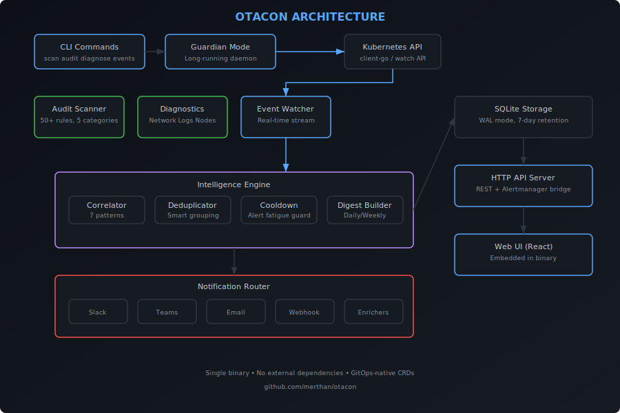

<div align="center">


<br/>

[](https://github.com/merthan/otacon/releases)
[](https://goreportcard.com/report/github.com/merthan/otacon)
[](https://github.com/merthan/otacon/actions)
[](LICENSE)
[](go.mod)

**Intelligent Kubernetes diagnostics, audit, and event correlation platform.**

Stop drowning in alerts. Get actionable intelligence.

[Quick Start](#-quick-start) · [Features](#-features) · [Installation](#-installation) · [Documentation](#-documentation)

</div>

---

## The Problem

Kubernetes generates thousands of events, but most monitoring tools just forward them as-is. The result? **Alert fatigue.** Operators ignore critical signals buried in noise.

**Otacon solves this** by correlating events into incidents, deduplicating noise, and delivering actionable intelligence — not just raw alerts.

| Traditional Monitoring | Otacon |
|---|---|
| 16 separate pod-eviction alerts | 1 incident: *"Node cascade failure on node-3"* |
| Raw events with no context | Root cause + impact + remediation |
| Manual health assessment | A-F scorecard across 5 categories |
| Per-event notifications | Smart deduplication + cooldown |

## ✨ Features

### CLI — Instant Cluster Intelligence

```
$ otacon scan

 CLUSTER HEALTH SCORECARD

   Overall Score: B+ (82/100)

 Security          ████████░░  78%   ✕ 3 critical, 5 warning
 Resource Mgmt     █████████░  88%   △ 2 warning
 Reliability       ███████░░░  72%   ✕ 1 critical, 4 warning
 Best Practices    █████████░  90%   ○ 3 info
 Network Policies  █████████░  85%   △ 1 warning

 TOP FINDINGS:
 🔴 CRIT  Container 'api' runs as root                    [Security]
 🔴 CRIT  Container 'worker' has no memory limits          [Resource Management]
 🟡 WARN  Deployment 'api-gateway' has only 1 replica      [Reliability]
```

### Customizable Scans

```bash
otacon scan --exclude-categories "Network Policies"   # Skip categories
otacon scan --severity critical                        # Only critical findings
otacon scan --categories Security,Reliability          # Specific categories
otacon scan --export report.html                       # Professional HTML report
otacon scan --min-score 70                             # CI/CD gate
otacon scan --explain                                  # Remediation guidance
```

### Guardian Mode — Continuous Monitoring

Runs as a daemon inside your cluster. Watches events in real-time, correlates them into incidents, and sends smart notifications.

```bash
# Local
otacon guardian start --port 8080 --ui

# In-cluster via Helm
helm install otacon ./deploy/helm/otacon \
  --namespace otacon-system --create-namespace
```

### Event Correlation Engine

7 built-in patterns detect complex failure scenarios:

- **Node Cascade Failure** — Node down → cascading evictions + scheduling failures
- **OOM Cascade** — Memory kill → crash loop → restart storm
- **Image Pull Chain** — Registry failure → blocked deployments
- **Volume Mount Failure** — PVC issues → stuck pods
- **Scheduling Pressure** — Resource exhaustion across cluster
- **DNS Resolution Failure** — CoreDNS issues → service breakdown
- **Probe Failure Cascade** — Health check failures → restart loops

### Smart Notifications

- **Deduplication** — 50 identical events → 1 summary
- **Cooldown** — Severity-based throttling (Critical: 15min, Warning: 60min)
- **Safety Valve** — Forces alert after 100 suppressed events
- **Enrichment** — Attaches pod logs, Grafana links, runbook URLs

**Channels:** Slack (Block Kit) · Teams (MessageCard) · Email (SMTP) · Webhook (JSON)

### 50+ Audit Rules

| Category | Rules | What It Checks |
|---|---|---|
| **Security** | 11 | Root containers, privileged mode, host networking, capabilities, service accounts |
| **Resource Management** | 8 | CPU/memory requests & limits, quotas, LimitRanges, HPA |
| **Reliability** | 7 | Liveness/readiness/startup probes, replicas, PDB, anti-affinity |
| **Best Practices** | 5 | Image tags, labels, registries, deployment strategy |
| **Network Policies** | 3 | Policy existence, default deny, service types |

### Web Dashboard

Dark-themed UI embedded in the binary — no separate deployment needed.

- **Dashboard** — Score trend chart, stat cards, incident timeline
- **Events** — Real-time event stream with severity/time filters
- **Audit** — Interactive scorecard with expandable findings
- **Resources** — Missing limits/requests/quotas analysis
- **Status** — System health, notification stats, storage metrics

### Deep Diagnostics

```bash
otacon diagnose network    # DNS resolution, endpoints, NetworkPolicy
otacon diagnose logs       # CrashLoopBackOff, OOMKilled, error patterns
otacon diagnose nodes      # Disk/memory/PID pressure, capacity
otacon diagnose all        # Everything at once
```

### Prometheus Metrics

Native `/metrics` endpoint:

```
otacon_events_total
otacon_events_by_severity{severity="critical|warning|info"}
otacon_incidents_total
otacon_notifications_sent_total
otacon_notifications_suppressed_total
otacon_audit_score
otacon_uptime_seconds
```

## 🚀 Quick Start

```bash
# Install
curl -sSL https://raw.githubusercontent.com/merthan/otacon/main/scripts/install.sh | sh

# Or with Go
go install github.com/merthan/otacon/cmd/otacon@latest

# Scan your cluster
otacon scan

# Detailed audit with remediation
otacon audit --explain

# Full diagnostics
otacon diagnose all

# Event timeline with correlation
otacon events --since 1h --correlate

# Export HTML report
otacon scan --export report.html
```

## 📦 Installation

### Quick Install Script

```bash
curl -sSL https://raw.githubusercontent.com/merthan/otacon/main/scripts/install.sh | sh
```

### Homebrew (macOS/Linux)

```bash
brew install merthan/tap/otacon
```

### Go Install

```bash
go install github.com/merthan/otacon/cmd/otacon@latest
```

### Binary Download

Download from [Releases](https://github.com/merthan/otacon/releases) — available for Linux, macOS (Intel + Apple Silicon), Windows.

### Docker

```bash
docker run --rm -v ~/.kube:/root/.kube ghcr.io/merthan/otacon:latest scan
```

### In-Cluster (Helm)

```bash
# Install CRDs
kubectl apply -f https://raw.githubusercontent.com/merthan/otacon/main/deploy/crds/otacon-crds.yaml

# Deploy
helm install otacon ./deploy/helm/otacon \
  --namespace otacon-system \
  --create-namespace \
  --set notifications.slack.enabled=true \
  --set notifications.slack.webhook="https://hooks.slack.com/..."

# Or with Kustomize
kubectl apply -k https://github.com/merthan/otacon/deploy/kustomize/base

# Or plain manifests
kubectl apply -f https://raw.githubusercontent.com/merthan/otacon/main/deploy/manifests/install.yaml
```

## 🏗️ Architecture

<div align="center">

</div>

### Design Principles

- **Single binary** — CLI + daemon + API + Web UI, zero runtime dependencies
- **Event-driven** — Kubernetes watch API, not polling
- **Correlate before notify** — Intelligence pipeline reduces noise 10-50x
- **GitOps-native** — CRDs for notification rules, audit policies, digests
- **Read-only** — Never modifies your cluster

## 🛠️ Commands

| Command | Description |
|---|---|
| `otacon scan` | Full cluster health scan with A-F scorecard |
| `otacon audit` | Best practice compliance check |
| `otacon diagnose network\|logs\|nodes\|all` | Deep diagnostics |
| `otacon resources` | Missing requests/limits analysis |
| `otacon events` | Event timeline with correlation |
| `otacon guardian start` | Start continuous monitoring daemon |
| `otacon completion bash\|zsh\|fish` | Shell completions |

### Key Flags

```bash
--context <name>              # Kubernetes context
--namespace <ns>              # Target namespace
--exclude-categories <list>   # Skip audit categories
--severity <level>            # Filter by severity
--export <file.html>          # Export report
--min-score <n>               # CI/CD quality gate
--explain                     # Show remediation
```

## 🔧 Configuration

See [examples/config.yaml](examples/config.yaml) for the full configuration reference.

```yaml
notifications:
  slack:
    enabled: true
    webhookUrl: "https://hooks.slack.com/..."
    channel: "#k8s-alerts"
intelligence:
  cooldown:
    defaultDuration: 60m
    perSeverity:
      CRITICAL: 15m
storage:
  path: /data/otacon.db
  retentionDays: 7
```

### CRDs (In-Cluster)

```yaml
apiVersion: otacon.io/v1alpha1
kind: NotificationRule
metadata:
  name: production-critical
spec:
  match:
    namespaces: ["production"]
    severities: ["Critical"]
  routing:
    - channel: slack
      target: "#prod-incidents"
```

## 📖 Documentation

| Document | Description |
|---|---|
| [Architecture](docs/architecture.md) | System design, data flow, scoring formula |
| [Getting Started](docs/getting-started.md) | Installation and first scan |
| [CLI Reference](docs/cli-reference.md) | All commands, flags, and examples |
| [Audit Rules](docs/audit-rules.md) | Complete 50+ rule reference |
| [CRD Reference](docs/crd-reference.md) | NotificationRule, AuditPolicy, DigestSchedule |
| [Examples](examples/) | Sample configs and CRD manifests |

## 🗺️ Roadmap

- [x] CLI: scan, audit, diagnose, events, resources
- [x] 50+ audit rules with A-F scorecard
- [x] Intelligence engine: correlation, dedup, cooldown
- [x] Notification channels: Slack, Teams, Email, Webhook
- [x] Web dashboard with real-time updates
- [x] Prometheus metrics
- [x] Helm chart, Kustomize, CRDs
- [ ] UI-based notification management
- [ ] Alertmanager bridge
- [ ] PagerDuty / OpsGenie channels
- [ ] Custom rule engine (YAML-defined rules)
- [ ] Multi-cluster support

## 🤝 Contributing

Contributions welcome! See [CONTRIBUTING.md](CONTRIBUTING.md).

```bash
git clone https://github.com/merthan/otacon.git
cd otacon
go mod tidy
make build
make test
```

## 📄 License

Apache License 2.0 — see [LICENSE](LICENSE).

---

<div align="center">

Built with ❤️ by [Merthan](https://github.com/merthan)

**If Otacon helps you, consider giving it a ⭐**

</div>
